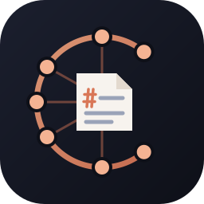
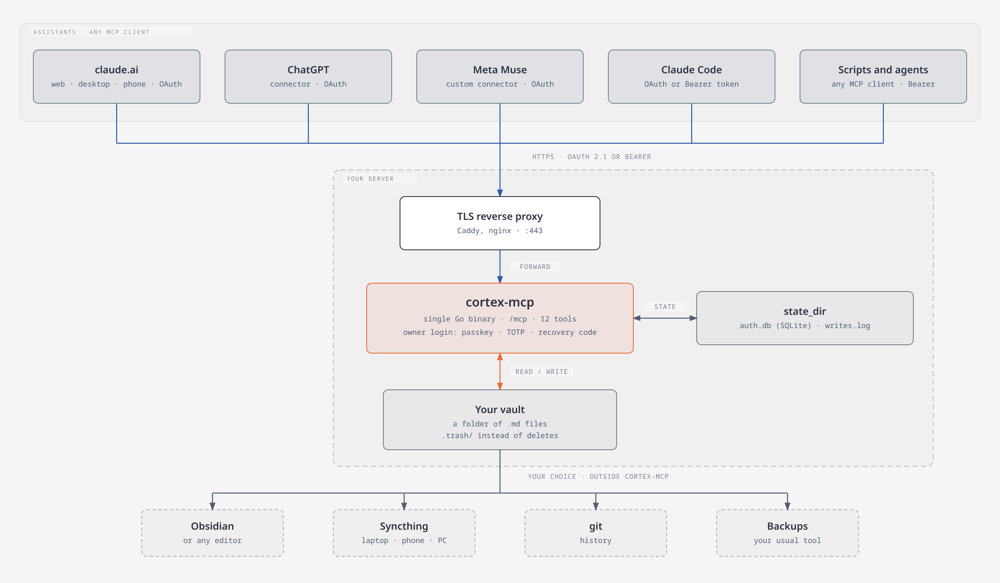

<div align="center">



# cortex-mcp

**One Markdown vault. Every AI assistant.**

A self-hosted [MCP](https://modelcontextprotocol.io) server that lets Claude, ChatGPT, Meta Muse, and any
other MCP client read and write the same folder of Markdown notes. The notes are the memory; the
assistant behind them is replaceable.

[](LICENSE)


[](https://github.com/JoseJimenez-M/cortex-mcp/releases)
[](https://github.com/JoseJimenez-M/cortex-mcp/actions/workflows/ci.yml)

</div>

---

## Why this exists

Every assistant keeps its own memory, and that memory is locked to the vendor. Move from one app to
another, or use two at once (one on the desktop, another on the phone), and each one knows a different
slice of you. When the app changes, the memory goes with it.

cortex-mcp turns that around. Your memory is a plain folder of `.md` files that you own, that opens in
Obsidian or any editor, and that you can sync, back up, and read without any AI at all. The server puts
that folder on the internet behind a proper login, and every assistant that speaks MCP connects to it.
Swap the assistant whenever you like; the notes stay.

---

## What it does

- Exposes one vault to every MCP client over Streamable HTTP, at a single URL such as
  `https://notes.example.com/mcp`.
- Gives assistants twelve tools to read, search, and edit notes (table below). There is no shell, no
  git, and no hard delete: a deleted note goes to `.trash/`.
- Protects edits with a per-note version, so a stale edit fails with `note_changed` instead of
  overwriting a newer one, and records every write in a log with the name of the app that made it.
- Lets assistant apps connect with OAuth 2.1 (claude.ai, ChatGPT, Meta Muse, Claude Code). Each
  connection is approved by you on a login page, with a passkey, an authenticator code, or a recovery
  code.
- Issues Bearer tokens for CLI agents and scripts that do not do OAuth.
- Sends your own instructions file to every assistant on connect, if you set one.

| Tool | What it does |
|------|--------------|
| `read_note` | Returns a note's content, modified time, and a `version`. |
| `list` | Lists the notes and subfolders of a folder, optionally recursive (at most 500 entries). |
| `search` | Case-insensitive text search; returns paths, line numbers, and snippets. |
| `search_tag` | Finds notes by tag, from frontmatter `tags` or inline `#tag`. |
| `backlinks` | Finds notes that link to a note by wikilink or Markdown link. |
| `recent` | Lists notes modified in the last 1–365 days, with the clients that changed them. |
| `create_note` | Creates a note; fails if it exists. |
| `append` | Adds text at the end of a note or of one section; needs no version. |
| `replace_section` | Replaces one section's body; needs the `version` from `read_note`. |
| `update_frontmatter` | Sets or removes frontmatter keys, body untouched; needs the `version`. |
| `move_note` | Moves or renames a note (also restores one from `.trash`); reports notes still linking to the old path, does not rewrite links. |
| `delete_note` | Moves a note to `.trash/`. Nothing is ever permanently deleted. |

All paths are vault-relative and use `/`. The read tools are annotated read-only; the write tools are
annotated with whether they are destructive or idempotent, so clients can ask for confirmation
appropriately.

---

## Requirements

- A machine you control that stays on: a small VPS is enough. Builds target Linux and macOS (amd64 and
  arm64) and Windows (amd64); the container image is multi-arch.
- A folder of Markdown notes (an Obsidian vault works as is).
- For assistant apps on the internet (claude.ai, ChatGPT, Meta Muse): a domain name and a TLS reverse
  proxy in front of the server (Caddy and nginx examples are in [docs/install.md](docs/install.md)).
- Go 1.26 to build from source.

---

## Install

The first release candidate is out: [v0.1.0-rc.1](https://github.com/JoseJimenez-M/cortex-mcp/releases/tag/v0.1.0-rc.1).
Signed binaries for Linux, macOS, and Windows, and a signed multi-arch container image:

```bash
docker pull ghcr.io/josejimenez-m/cortex-mcp:v0.1.0-rc.1
```

Verify the signature before running either one, then follow the systemd or Docker Compose setup in
[docs/install.md](docs/install.md). To build from source instead:

```bash
git clone https://github.com/JoseJimenez-M/cortex-mcp.git
cd cortex-mcp
go build -o bin/cortex-mcp ./cmd/cortex-mcp
cp config.example.yaml config.yaml          # set vault, state_dir, public_url
```

Every configuration key, default, and limit is in [docs/configuration.md](docs/configuration.md); the
commented example is [`config.example.yaml`](config.example.yaml).

---

## First run

```bash
./bin/cortex-mcp setup -config config.yaml                 # you, the owner, for OAuth apps
./bin/cortex-mcp token create -config config.yaml my-laptop  # optional: a Bearer token
./bin/cortex-mcp serve -config config.yaml
```

`setup` prints three login factors once: a TOTP URI, ten recovery codes, and a passkey link to open
within 10 minutes while the server runs. Keep them in different places, so losing one never locks you
out. `token create` prints its token once.

Then connect each assistant with the server's `/mcp` URL. Claude Code, for example:

```bash
claude mcp add --scope user --transport http cortex https://notes.example.com/mcp
```

claude.ai, ChatGPT, Meta Muse, and generic MCP clients are covered step by step in
[docs/connecting-clients.md](docs/connecting-clients.md).

---

## How it fits together

<div align="center">



</div>

| Piece | Role |
|-------|------|
| `internal/vault` | The only code that touches the vault, through `os.Root`: no symlinks followed, protected folders, atomic and versioned writes. |
| `internal/tools` | The twelve MCP tools on top of the vault. |
| `internal/server` | HTTP, sessions, rate limits, token checks. |
| `internal/oauth` | OAuth 2.1 authorization server (built on `zitadel/oidc`), the login page, passkeys, TOTP, recovery codes, client registration. |
| `internal/tokens`, `internal/authdb` | Bearer tokens and the auth database; every secret is stored as a hash. |
| `internal/cli` | The commands below. |

```
cortex-mcp serve [-config path]
cortex-mcp setup [-config path] [-passkey | -force]
cortex-mcp unlock-totp [-config path]
cortex-mcp reset-auth [-config path] [-yes]
cortex-mcp clients list [-config path]
cortex-mcp clients revoke [-config path] ID
cortex-mcp token create [-config path] NAME
cortex-mcp token list [-config path]
cortex-mcp token revoke [-config path] NAME
cortex-mcp version
```

Flags go before `NAME` and `ID`. The config path defaults to `$CORTEX_MCP_CONFIG`, then
`/etc/cortex-mcp/config.yaml`. `GET /healthz` answers `ok` without authentication. What each command
does is in [docs/install.md](docs/install.md#commands).

---

## Security

The server is internet-facing and has write access to private notes, so security comes before
features.

- All file access is confined to the vault through `os.Root`; symbolic links are never followed;
  `.git`, `.obsidian`, `.cortex-mcp`, `.stversions`, and `.stfolder` are off limits, and `.trash` is receive-only.
- Tool code runs no shell, no git, and no network calls. The server's only outbound request fetches
  OAuth client metadata documents, never from private or loopback addresses.
- Every route except `GET /healthz` and the OAuth endpoints needs a token. OAuth follows the MCP
  authorization spec (2025-11-25): PKCE S256, tokens bound to this server's `/mcp` URL, rotating
  refresh tokens with reuse detection, redirect URIs limited to an allowlist.
- The login page is bound to the browser that started the sign-in; requests are rate limited per
  client and per source address; writes pause when the disk has less than 1 GiB free.
- Release binaries and images are signed keylessly with cosign and ship SBOMs.

The threat model, every defence with its limits, and the residual risks are in
[docs/security.md](docs/security.md). Report vulnerabilities privately as described in
[SECURITY.md](SECURITY.md).

---

## Things worth knowing

- **One owner.** The server has a single owner who approves every connection. It is a personal
  server, not a multi-user service.
- **Approve only sign-ins you started, just now.** Anyone can start a sign-in for claude.ai or ChatGPT
  and send you the link; approving it would connect their account to your vault, even though the page
  names a familiar app.
- **It does not sync the vault.** cortex-mcp reads and writes the folder on the server. To have the
  same notes on your laptop and phone, pair the folder with Syncthing, Obsidian Sync, or similar.
- **Moves do not rewrite links.** `move_note` lists the notes that still point to the old path so the
  assistant (or you) can fix them.
- **Note content is data, not instructions.** The server never interprets note text, and it tells
  assistants the same on connect. What an assistant does with what it reads is still up to the
  assistant.
- **Assistant apps differ.** Some register themselves automatically, some ask for a client ID by hand
  (Meta Muse does); [docs/connecting-clients.md](docs/connecting-clients.md) has the details per app.

---

## Documentation

| Guide | Contents |
|-------|----------|
| [docs/install.md](docs/install.md) | Requirements, binary or image, verifying downloads, reverse proxy, first-time setup, commands |
| [docs/configuration.md](docs/configuration.md) | Every key, default, and validation rule; fixed limits |
| [docs/connecting-clients.md](docs/connecting-clients.md) | Claude Code, claude.ai, ChatGPT, Meta Muse, generic MCP clients |
| [docs/security.md](docs/security.md) | Threat model, defences, deliberate non-features, residual limits |
| [docs/releasing.md](docs/releasing.md) | Cutting and verifying a release, upgrading an installation |
| [CONTRIBUTING.md](CONTRIBUTING.md) | Contributor licence agreement, workflow, gates |
| [SECURITY.md](SECURITY.md) | Reporting vulnerabilities, supported versions, scope |

The design is in [`docs/specs/2026-10-01-cortex-mcp-design.md`](docs/specs/2026-10-01-cortex-mcp-design.md).

---

## Development

Test-driven: write the failing test first, then the minimum code. Read [`AGENTS.md`](AGENTS.md) before
changing anything; it lists the invariants and the package layout.

```bash
go test -race ./...
go vet ./...
go run honnef.co/go/tools/cmd/staticcheck@2026.2.1 ./...
go run golang.org/x/vuln/cmd/govulncheck@v1.8.0 ./...
go run github.com/securego/gosec/v2/cmd/gosec@v2.29.0 ./...
```

---

## Bugs and contributions

Bug reports and feature ideas are welcome as issues:
<https://github.com/JoseJimenez-M/cortex-mcp/issues>. Security problems go through private reporting
instead ([SECURITY.md](SECURITY.md)). Outside pull requests are not accepted until the contributor
licence agreement in [CONTRIBUTING.md](CONTRIBUTING.md) is final.

## Licence

Source-available under [PolyForm Noncommercial 1.0.0](LICENSE), by
[Jose Jimenez](https://github.com/JoseJimenez-M). Personal, research, hobby, and noncommercial
organizational use is permitted. Commercial use (companies, paid services, resale, including modified
versions) requires a separate licence: contact jimenez331375@gmail.com. This is not an OSI open source
licence.

The Go standard library and modules built into the binary keep their own licences, reproduced in
[`THIRD_PARTY_NOTICES`](THIRD_PARTY_NOTICES).
