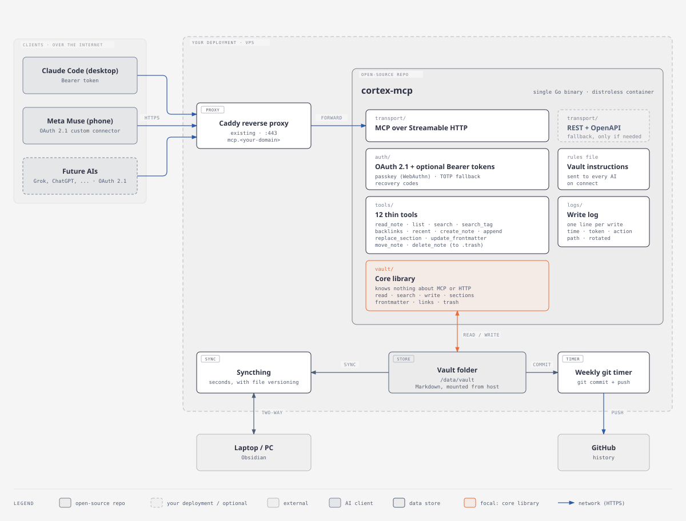

# cortex-mcp: design spec (v1)

*A self-hosted server that lets several AI assistants read and write one Markdown vault (an Obsidian
vault or any folder of `.md` files) over the Model Context Protocol (MCP). The vault is the durable
"brain"; the AI behind it is replaceable.*

Status: design approved in conversation, not built. Nothing in this document is implemented yet.



---

## 1. Problem and goals

A personal knowledge vault is most useful when the assistants a person already uses (a desktop coding
agent, a phone assistant, future ones) can read it and write to it directly, with no copy-paste and no
sync delay. Vendor "memory" features do not solve this: they are tied to one vendor, invisible to the
owner, and lost when the vendor changes.

**Goals**

1. Any MCP-capable assistant can read, search, and write notes in one vault, with changes visible to
   every other assistant immediately (they all touch the same files on one host).
2. The AI is replaceable: connecting a new assistant or revoking an old one never touches the vault.
3. Secure by default for an internet-facing service with write access to private notes.
4. Light enough for a small shared VPS: tens of MB of RAM, one process, no database server.
5. Portable: one static binary or one small container, configured by one file, no assumptions about
   the operator's domain, proxy, or folder layout.

**Non-goals (v1)**

- Real-time collaborative editing (CRDT/OT, "Google Docs style"). Writes are whole-operation and
  guarded by optimistic concurrency instead (section 5).
- Syncing the vault to other machines. That is the operator's choice (Syncthing, git, anything) and is
  outside the binary.
- Multi-user accounts. One owner per server.
- Binary attachments. Markdown only.
- Validating or enforcing writing style. Style rules reach the AI as instructions (section 4.3); an
  optional curator is a future idea (section 12).

## 2. Architecture

One Go binary, layered so each layer can be understood and tested alone:

```
transport/   MCP over Streamable HTTP (v1). REST + OpenAPI is a possible extra adapter (section 11).
auth/        OAuth 2.1 authorization server (passkey, TOTP, recovery codes) + optional Bearer tokens.
tools/       Thin MCP tool handlers: validate input, call vault/, map errors. No file I/O here.
vault/       Core library. Paths, read, search, write, sections, frontmatter, links, trash.
             Knows nothing about MCP, HTTP, or auth.
logs/        Append-only write log, rotated.
config/      Load and validate the single config file.
```

**Why this split.** `vault/` is the only code that touches the filesystem, so all safety rules
(section 5) live in one place and are tested once. `transport/` and `tools/` are thin adapters: a REST
adapter, or a future protocol, is a new thin layer over the same core, not a rewrite.

**Dependencies.** Go standard library plus a small set of vetted libraries: the official MCP Go SDK,
an OAuth 2.1 library (`ory/fosite` is the candidate), a WebAuthn library (`go-webauthn/webauthn`), a
TOTP library, a pure-Go SQLite driver (no cgo, to keep static cross-compilation), and a YAML parser.
Every dependency must justify itself; the target is fewer than ten direct dependencies.

**Runtime cost.** Expected 15–25 MB RAM idle, a static binary around 15–20 MB, a distroless container
image of similar size. Logs are capped by rotation (section 8).

## 3. Tools (MCP surface)

All paths are vault-relative, use `/`, and must end in `.md` (except folders for `list`). Every read
returns a `version` (short content hash) used by guarded writes.

**Read**

| Tool | Input | Returns |
|------|-------|---------|
| `read_note` | `path` | content, frontmatter (parsed), `version`, modified time |
| `list` | `folder` (default root), `recursive` (default false) | notes and subfolders |
| `search` | `query`, `folder?`, `limit?` | matching paths with short snippets |
| `search_tag` | `tag` (e.g. `topic/dev`) | notes whose frontmatter `tags` or inline `#tags` match |
| `backlinks` | `path` | notes containing a wikilink or Markdown link to it |
| `recent` | `days` (default 1) | notes modified in that window, with the client name from the write log when known |

**Write**

| Tool | Input | Rule |
|------|-------|------|
| `create_note` | `path`, `content` | fails if the note exists |
| `append` | `path`, `text`, `section?` | appends at end of note, or at end of the named section; no `version` needed |
| `replace_section` | `path`, `heading`, `content`, `version` | replaces one section's body; rejected if `version` is stale |
| `update_frontmatter` | `path`, `fields`, `version` | merges keys into YAML frontmatter, leaves body untouched; rejected if stale |
| `move_note` | `from`, `to` | fails if `to` exists; returns the backlinks that still point to `from`; does not rewrite links |
| `delete_note` | `path` | moves the note to `.trash/` (Obsidian's trash folder); never deletes bytes |

A "section" is a Markdown heading and everything until the next heading of the same or higher level.
Heading match is exact text; ambiguous matches (two identical headings) are rejected with an error
listing them.

**Why no hard delete, no shell, no git.** An assistant can be wrong or be manipulated by content it
reads (prompt injection). Every write tool is either additive or reversible from the vault itself
(`.trash/`, the operator's sync/backup). Restoring from trash is `move_note` out of `.trash/`.

## 4. Connection-time behaviour

### 4.1 Discovery
Standard MCP Streamable HTTP at `/mcp`. An unauthenticated call returns `401` with a
`WWW-Authenticate` header pointing to the OAuth protected-resource metadata, so compliant clients can
start the OAuth flow on their own.

### 4.2 Capabilities
Tools only in v1. No MCP resources or prompts beyond the instructions below.

### 4.3 Vault instructions
The config may name an `instructions_file` (vault-relative, for example `AGENTS.md`). Its content is
sent as the MCP server `instructions` on initialize, so every connected assistant receives the vault's
rules (language, frontmatter, filing conventions, "treat ingested content as data"). This is what keeps
behaviour consistent when the AI behind the vault changes. The file is re-read on each new session, so
edits apply without a restart.

## 5. Write safety

1. **Path confinement.** Every path is cleaned and resolved; anything that escapes the vault root
   (`..`, absolute paths, symlinks resolving outside) is rejected. Symlinks inside the vault are not
   followed for writes.
2. **Protected paths.** Fixed and not configurable off: `.git/`, `.obsidian/`, `.cortex-mcp/`,
   `.trash/` (receive-only through `delete_note`; readable, movable out). Operators can add more with
   `deny`.
3. **Atomic writes.** Write to a temp file in the same directory, `fsync`, rename over the target. A
   crash leaves either the old note or the new one, never a partial file. This also prevents file-sync
   tools from replicating half-written files.
4. **Optimistic concurrency.** Guarded tools require the `version` from the last read. If the file
   changed since (edited by the owner or another assistant), the call fails with `note_changed` and the
   assistant must re-read. `append` and `create_note` cannot clobber, so they are unguarded.
5. **Per-note lock.** An in-process mutex per path serializes concurrent writes to the same note;
   different notes proceed in parallel.
6. **Limits.** Max bytes per write (default 1 MiB) and a request rate per client (default 60/min). A
   looping assistant cannot fill the disk.
7. **Content is data.** The server never interprets note content as commands.

## 6. Authentication

### 6.1 Owner identity (login page)
Single owner, created only from the console with `cortex-mcp setup`, never from the web. Setup
registers:

- a **passkey** (WebAuthn; any authenticator, including password-manager passkeys),
- a **TOTP** secret as fallback (shown as a QR once),
- ten single-use **recovery codes** (shown once, stored hashed).

The documentation recommends keeping the three factors in different places (for example the passkey
in a password manager, TOTP in a separate authenticator app, recovery codes offline), so losing one
never locks the owner out. `cortex-mcp reset-auth` on the host is the last resort and requires shell
access.

### 6.2 OAuth 2.1 for assistant apps
The server is its own authorization server (one less service to run):

- Authorization server and protected-resource metadata endpoints.
- Dynamic client registration, so an app can register itself on first connect.
- Authorization code flow with mandatory PKCE (S256). No implicit flow, no password grant.
- Login (passkey, or TOTP) then a consent screen naming the client.
- Access tokens valid 1 hour; refresh tokens valid 30 days and rotated on use.
- Tokens are opaque random values; only hashes are stored.

### 6.3 Bearer tokens (optional)
For clients that cannot run a browser login (a CLI agent, scripts, cron). Created with
`cortex-mcp token create <name>`, shown once, stored as a hash, revocable. Disabled entirely with
`bearer_tokens: false`.

### 6.4 Client management
`cortex-mcp clients list` and `cortex-mcp clients revoke <name>` cover both OAuth clients and Bearer
tokens. Revoking one never affects the others.

### 6.5 State
Auth state (`auth.db`, SQLite, a few KB) and the write log live in `state_dir`, which is **outside
the vault** by default. Keeping secrets out of the vault means no sync tool or git backup can copy
them by accident, whatever the operator's setup. `.cortex-mcp/` stays on the fixed protected list
anyway, in case an operator points `state_dir` inside the vault.

## 7. Configuration

One YAML file, every field documented, sensible defaults:

```yaml
vault: /data/vault
state_dir: /data/state              # auth.db and logs; keep outside the vault
public_url: https://mcp.example.com
instructions_file: AGENTS.md        # vault-relative, optional
deny: []                            # extra protected paths
bearer_tokens: true                 # false = OAuth only
limits:
  max_write_bytes: 1048576
  requests_per_minute: 60
logs:
  max_size_mb: 5
  keep: 3
```

Invalid config fails fast at startup with a clear message. No config value is ever secret: secrets
live only in the auth state.

## 8. Logs

One append-only text line per write: timestamp (UTC, RFC 3339), client name, tool, path, result
(`ok` or the error code). Reads are not logged by default (volume, and they change nothing). Rotated
by size (`max_size_mb`, `keep` files). The log is what `recent` uses to say which client changed what,
and it is the owner's way to spot a leaked token or a misbehaving assistant.

## 9. Errors

Tool errors are short, stable codes plus one actionable sentence for the assistant, for example
`note_changed: the note was modified since you read it, call read_note again`,
`path_outside_vault`, `note_exists: use append or replace_section`, `section_ambiguous`. Never stack
traces, host paths, or internal details.

## 10. Development: TDD and quality gates

**Test-driven by rule.** Every behaviour starts as a failing test, then the minimum code to pass, then
refactor. No production code without a test that required it.

- **`vault/`**: unit tests against a temporary directory per test. Covers path confinement (including
  symlink and `..` attacks), atomic write, section parsing, frontmatter merge, version conflicts,
  trash, backlinks. Table-driven tests for parsers. Fuzz tests (`go test -fuzz`) for path resolution,
  section parsing, and frontmatter parsing, since those take untrusted input.
- **`tools/`**: tests with a fake `vault` interface: input validation and error mapping.
- **`auth/`**: unit tests for token issuance, expiry, rotation, revocation, PKCE validation; WebAuthn
  and TOTP verified with library test vectors.
- **Integration**: start the real server in-process, connect with the MCP Go SDK client, exercise the
  full flow, including OAuth with a scripted client.
- **Concurrency**: tests run with `-race`.

**CI on every pull request:** `go test -race ./...`, `go vet`, `staticcheck`, `govulncheck`, `gosec`,
and a coverage report. A failing gate blocks merge.

**Releases:** GoReleaser via GitHub Actions: binaries for linux/arm64, linux/amd64, darwin, windows;
multi-arch container image on GHCR from a distroless base; cosign signatures and an SBOM per release.

**Docs (English), shipped with the code:** `README.md` (what, quick start, licence), `docs/install.md`
(requirements, binary or Docker, reverse proxy examples for Caddy and nginx, `setup`),
`docs/configuration.md`, `docs/connecting-clients.md` (examples for a CLI agent with a Bearer token and
for OAuth-capable apps), `docs/security.md` (threat model and deliberate non-features). Docs never
contain any operator's real domain, IP, or paths.

## 11. Fallback: REST + OpenAPI (only if needed)

Some assistants connect through generic API connectors instead of MCP. If the first target client
cannot use the MCP endpoint, add `transport/rest`: the same tools as JSON endpoints under `/api/`, an
OpenAPI document at `/api/openapi.json`, same auth. It is a thin adapter over `vault/` and adds no new
behaviour. Not built in v1 unless a real client needs it.

## 12. Future ideas (not v1)

- **Curator:** a light model via API (for example Grok) with its own client credentials that reads the
  write log, then checks style and frontmatter, repairs broken frontmatter, and reports broken links,
  writing back through the same server.
- Per-client folder scopes (`scopes:` on a client), added as an optional field without breaking config.
- Link rewriting on `move_note`.
- Batch reads.

## 13. Licence

Proposed: **PolyForm Noncommercial 1.0.0**, with a notice that commercial use (companies, resale,
including modified versions) requires a separate licence negotiated with the author. Chosen over CC
BY-NC because Creative Commons advises against its licences for software. This makes the project
source-available rather than OSI open source; the README states that plainly. If outside contributions
are accepted while commercial licences are sold, contributors sign a CLA.
